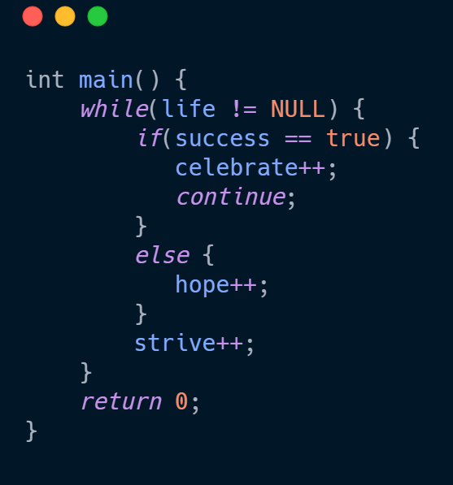

# Hi   I'm Aditya 😃
   

   
- 👨🏽‍🎓 Engineering Student 
- ✌🽠MERN stack | Data Structures 
- 👨🏽‍💻 Programmer & Aspiring Software Developer 
- 📰 News Junkie 
- ⚽ Sports fanatic 

 #### Currently, I am into Competitive Programming. Would love to collab on some exciting projects.
   

 
### Reach Me via [LinkedIn](https://www.linkedin.com/in/aditya-nath-jha-0b47421b5/) or visit my [Website](https://aditya-nath-jha.herokuapp.com/) 🤙🏻
